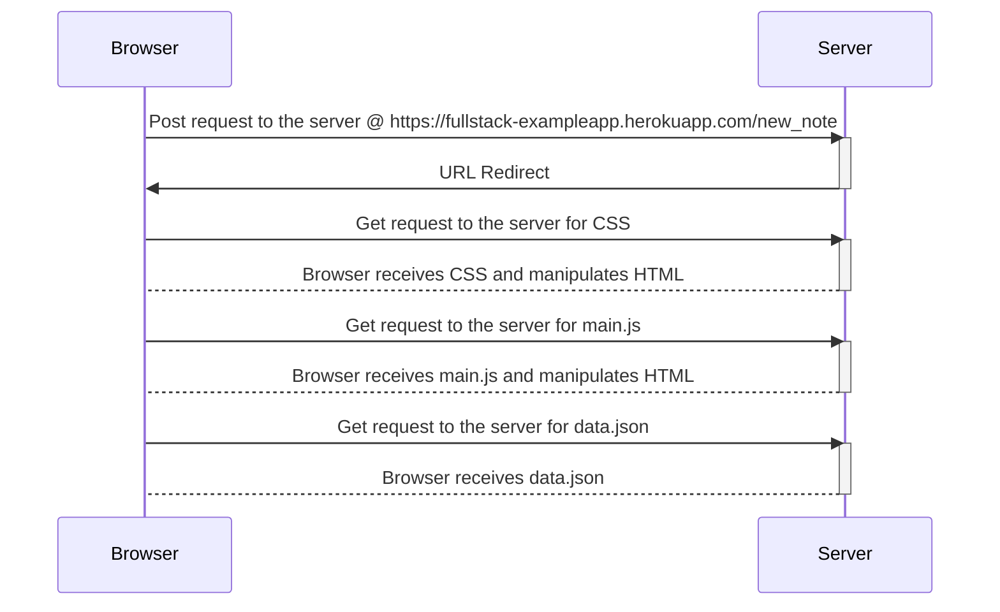

# Exercise 0.4

```mermaid
sequenceDiagram
    participant Browser
    participant Server

Browser ->> Server: Post request to the server @ https://fullstack-exampleapp.herokuapp.com/new_note
activate Server
Server ->> Browser: URL Redirect
deactivate Server

Browser ->> Server: Get request to the server for CSS
activate Server
Server --> Browser: Browser receives CSS and manipulates HTML
deactivate Server

Browser ->> Server: Get request to the server for main.js
activate Server
Server --> Browser: Browser receives main.js and manipulates HTML
deactivate Server

Browser ->> Server: Get request to the server for data.json
activate Server
Server --> Browser: Browser receives data.json
deactivate Server

```
