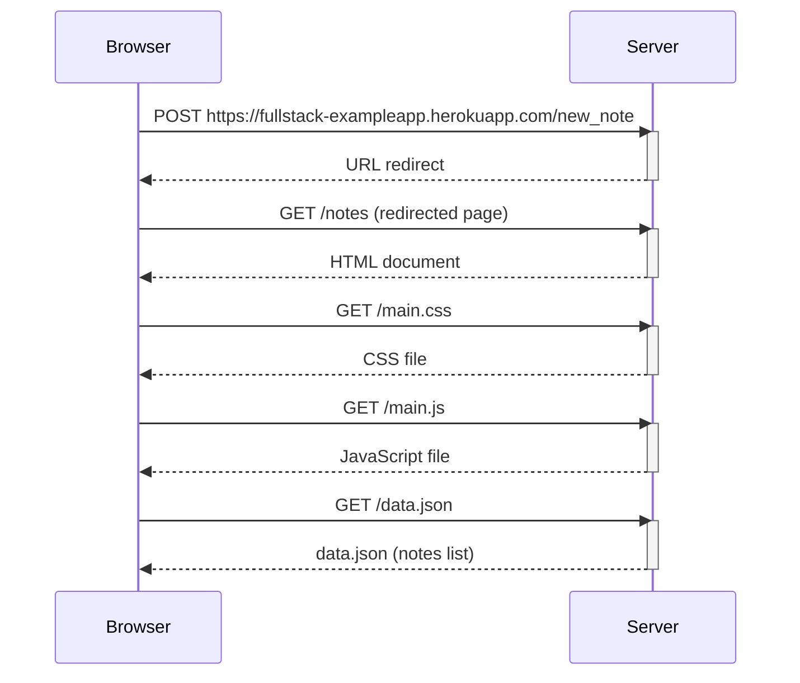

```mermaid
sequenceDiagram
    participant Browser
    participant Server

    Browser->>Server: POST https://fullstack-exampleapp.herokuapp.com/new_note
    activate Server
    Server-->>Browser: URL redirect
    deactivate Server

    Browser->>Server: GET /notes (redirected page)
    activate Server
    Server-->>Browser: HTML document
    deactivate Server

    Browser->>Server: GET /main.css
    activate Server
    Server-->>Browser: CSS file
    deactivate Server

    Browser->>Server: GET /main.js
    activate Server
    Server-->>Browser: JavaScript file
    deactivate Server

    Browser->>Server: GET /data.json
    activate Server
    Server-->>Browser: data.json (notes list)
    deactivate Server
```
